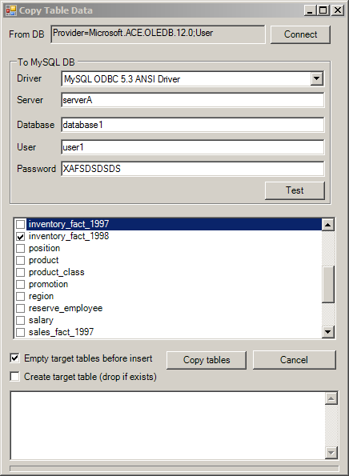

# MySQL Data Importer

Originally posted here: 
https://www.codeproject.com/Articles/1097407/MySQL-Data-Importer

Tool that will let you import data from SQL Server and Access to MySQL

## Introduction
I needed to import data from MS SQL Server to MySQL. I first tried to use MySQL Workbench but ran into some problem. So I wrote a tool to copy table schema and data to MySQL. You can download it here.

Try something like:
```
SQL
"<div style='background-image:url(bg.aspx?color=99ccff&value="+ cstr(

CASE [Organisation].[Level 03].CurrentMember.Name
WHEN 'Main' THEN [Measures].[Total monthly profit]/1500*100
ELSE             [Measures].[Total monthly profit]/500*100
END

)+"); background-repeat:no-repeat; width: 100px; text-align:right'>"+
format([Measures].[Unit Sales],"Standard")+"</div>"
```


## Background
I have tested the tool against MS SQL Server and Access databases. Not all data types are supported. You can modify the application to support other data types and databases (like Oracle).

## Required Components
In case you do not have MySQL ODBC driver or Microsoft Access OLEDB provider, you can download them here:

- Microsoft Access Database Engine
- MySQL ODBC driver - select version and choose "No thanks, just start my download."

## Using the Code
When you click the connect button, you will get OLEDB dialog asking you to select the provider and the connection information. 
Here, you can also test the connection. The connection string returned by EditConnectionString() function is stored in the Windows registry.

```
    Private Sub btnConnect_Click(ByVal sender As System.Object, ByVal e As System.EventArgs) _
	Handles btnConnect.Click

        Dim sConnectionString As String = "Provider=SQLOLEDB.1"
        sConnectionString = EditConnectionString(sConnectionString)
        If sConnectionString = "" Then
            Exit Sub
        End If

        txtConnect.Text = sConnectionString

        Dim oAppRegistry As New AppRegistry
        oAppRegistry.SetRegistryValue("ConnectionString", sConnectionString)

        SetTableCombo()
    End Sub
```

EditConnectionString function uses DataLinks ActiveX object to generate the connection string based on user input. The ease of working with COM objects is the primary reason I chose VB.NET for this app.

```
    Protected Function EditConnectionString(ByVal sConnectionString As String) As String
        Try
            Dim oDataLinks As Object = CreateObject("DataLinks")
            Dim cn As Object = CreateObject("ADODB.Connection")

            cn.ConnectionString = sConnectionString
            oDataLinks.hWnd = Me.Handle

            If Not oDataLinks.PromptEdit(cn) Then
                'User pressed cancel button
                Return ""
            End If

            cn.Open()

            Return cn.ConnectionString

        Catch ex As Exception
            MsgBox(ex.Message)
            Return ""
        End Try
    End Function
```
    
Once you enter MySQL server information and click Test, the connection information will be saved into registry and GetMySqlConnectionString() will create the MySQL connection string. The user will see Success message box or an Error message box.

```
    Private Sub txtTest_Click(sender As System.Object, e As System.EventArgs) Handles txtTest.Click

        Dim oAppRegistry As New AppRegistry
        oAppRegistry.SetRegistryValue("Driver", cboDriver.Text)
        oAppRegistry.SetRegistryValue("Server", txtServer.Text)
        oAppRegistry.SetRegistryValue("Database", txtDatabase.Text)
        oAppRegistry.SetRegistryValue("User", txtUser.Text)
        oAppRegistry.SetRegistryValue("Password", txtPassword.Text)

        Try
            Dim cnOdbc As OdbcConnection = New OdbcConnection(GetMySqlConnectionString())
            cnOdbc.Open()
            cnOdbc.Close()
        Catch ex As Exception
            MsgBox(ex.Message)
            Exit Sub
        End Try

        MsgBox("Success")
    End Sub
```
    
When the form is opened, this sub will retrieve the connection string from the registry. It will also call SetTableCombo() to populate the list of available tables.

```
    Private Sub frmExport_Load(sender As System.Object, e As System.EventArgs) Handles MyBase.Load
        Dim oAppRegistry As New AppRegistry
        txtConnect.Text = oAppRegistry.GetRegistryValue("ConnectionString")

        If txtConnect.Text <> "" Then
            SetTableCombo()
        End If

        Dim sDriver As String = oAppRegistry.GetRegistryValue("Driver")
        If sDriver = "" Then
            cboDriver.SelectedIndex = 0
        Else
            cboDriver.SelectedItem = sDriver
        End If

        txtServer.Text = oAppRegistry.GetRegistryValue("Server")
        txtDatabase.Text = oAppRegistry.GetRegistryValue("Database")
        txtUser.Text = oAppRegistry.GetRegistryValue("User")
        txtPassword.Text = oAppRegistry.GetRegistryValue("Password")
    End Sub
```
    
SetTableCombo() to populate the list of available tables. It uses GetOleDbSchemaTable() function to get list of tables from an OLEDB connection.

```
    Sub SetTableCombo()
        cboTable.Items.Clear()

        Dim oTable As DataTable
        Try
            Dim cnOleDb As New OleDbConnection(txtConnect.Text)
            cnOleDb.Open()

            oTable = cnOleDb.GetOleDbSchemaTable(OleDbSchemaGuid.Tables, _
             New Object() {Nothing, Nothing, Nothing, "TABLE"})
            cnOleDb.Close()
        Catch ex As Exception
            MsgBox(Err.Description)
            Exit Sub
        End Try

        For i As Integer = 0 To oTable.Rows.Count - 1
            Dim sSchema As String = oTable.Rows(i)("TABLE_SCHEMA") & ""
            Dim sTableName As String = oTable.Rows(i)("TABLE_NAME") & ""
            cboTable.Items.Add(sTableName)
        Next

        If cboTable.Items.Count > 0 Then
            cboTable.SelectedIndex = 0
        End If

    End Sub
```

When you click on the "Copy tables" button, this sub will check if SetTableCombo() populated the table list and will also check if user selected a table(s) to export. Next, it will loop through the list of selected tables and call ExportTable sub for each table.

```
    Private Sub btnExport_Click(ByVal sender As System.Object, ByVal e As System.EventArgs) _
	Handles btnExport.Click

        If cboTable.Items.Count = 0 Then
            MsgBox("Please connect to the source database.")
            Exit Sub
        End If

        If cboTable.CheckedItems.Count = 0 Then
            MsgBox("Please select tables to copy.")
            Exit Sub
        End If

        txtLog.Clear()

        If cboTable.CheckedItems.Count > 0 Then
            Dim cnOdbc As OdbcConnection = New OdbcConnection(GetMySqlConnectionString())
            cnOdbc.Open()

            Dim cn As New OleDbConnection(txtConnect.Text)
            cn.Open()

            For i As Integer = 0 To cboTable.CheckedItems.Count - 1
                Dim sTable As String = cboTable.CheckedItems(i).ToString
                ExportTable(sTable, cn, cnOdbc)
            Next

            cnOdbc.Close()
            cn.Close()
        End If

    End Sub
```

ExportTable is the most important sub:

It will first get the record count for the destination table into iMySqlRecCount.
If there is data and the user had selected "Empty target table before insert", all records in the destination table will be deleted.
If user had selected "Create target table (drop if exists), the sub will drop destination table (if it exists) and will create new destination table. GetColumnsTableAccess function will be used to get the SQL for Access and GetColumnsTableSqlServer will be used for SQL Server.
It will first get the record count for the source table into iCount.
Finally, it will generate the INSERT INTO statement for each source record and run it against the destination database.

```
Private Sub ExportTable(ByVal sTableName As String, ByRef cn As OleDbConnection, _
	ByRef cnOdbc As OdbcConnection)

        Dim bMySqlTableExists As Boolean = False
        Dim iMySqlRecCount As Integer = 0

        Try
            Dim oMySqlCmd As New OdbcCommand("SELECT Count(*) FROM " & sTableName, cnOdbc)
            iMySqlRecCount = Integer.Parse(oMySqlCmd.ExecuteScalar().ToString())
            bMySqlTableExists = True
        Catch ex As Exception
            'Ignore - assume table dos not exist
        End Try

        If chkDeleteData.Checked And iMySqlRecCount > 0 Then
            Log("Deleting data from table: " & sTableName)

            OpenConnections(cn, cnOdbc)
            Dim sSql1 As String = "DELETE FROM " & sTableName
            Dim oCmd1 As New OdbcCommand(sSql1, cnOdbc)

            Try
                oCmd1.ExecuteNonQuery()
            Catch ex As Exception
                Log(ex.Message & vbTab & "SQL: " & sSql1)
            End Try
        End If

        If chkCreateTable.Checked Then

            If bMySqlTableExists Then
                Log("Drop table: " & sTableName)

                Dim oCmdDrop As New OdbcCommand("DROP TABLE " & PadQuotes(sTableName), cnOdbc)

                Try
                    oCmdDrop.ExecuteNonQuery()
                    bMySqlTableExists = False
                Catch ex As Exception
                    Log("Could not drop table: " & sTableName & ", " & ex.Message & vbTab)
                End Try

            End If

            Log("Create table: " & sTableName)
            OpenConnections(cn, cnOdbc)

            'Make create table statement
            Dim sConnectionString As String = txtConnect.Text.ToUpper()
            Dim sSql1 As String = ""

            If sConnectionString.IndexOf(".ACE.OLEDB") = -1 _
		OrElse sConnectionString.IndexOf(".JET.OLEDB") = -1 Then
                sSql1 = GetColumnsTableAccess(sTableName, cn)
            Else
                sSql1 = GetColumnsTableSqlServer(sTableName, cn)
            End If

            Dim oCmd1 As New OdbcCommand(sSql1, cnOdbc)

            Try
                oCmd1.ExecuteNonQuery()
                bMySqlTableExists = True
            Catch ex As Exception
                Log(ex.Message & vbTab & "SQL: " & sSql1)
            End Try
        End If

        Dim sSql As String = "SELECT Count(*) FROM " & PadQuotes(sTableName)
        Dim cmd As New OleDbCommand(sSql, cn)

        Dim iCount As Integer = Integer.Parse(cmd.ExecuteScalar().ToString())
        If iCount = 0 Then
            'Nothing to copy - Exit
            Exit Sub
        End If

        If bMySqlTableExists = False Then
            Log("Destination table does not exist: " & sTableName)
            Exit Sub
        End If

        'Copy Data
        ProgressBar1.Maximum = iCount
        lbCount.Visible = True

        Log("Copying " & iCount & " rows from table: " & sTableName)

        cmd = New OleDbCommand("SELECT * FROM " & sTableName, cn)

        Dim dr As OleDbDataReader = cmd.ExecuteReader()
        Dim oSchemaRows As Data.DataRowCollection = dr.GetSchemaTable.Rows

        Dim sRow As String
        Dim i As Integer
        Dim iRow As Integer = 0

        'Get Header
        Dim sHeader As String = ""
        For i = 0 To oSchemaRows.Count - 1
            Dim sColumn As String = oSchemaRows(i)("ColumnName")
            If i <> 0 Then
                sHeader += ", "
            End If
            sHeader += sColumn
        Next

        While dr.Read()
            sRow = ""
            For i = 0 To oSchemaRows.Count - 1
                If sRow <> "" Then
                    sRow += ", "
                End If

                sRow += GetValueString(dr.GetValue(i))
            Next

            OpenConnections(cn, cnOdbc)
            Dim sSql1 As String = "INSERT INTO " & sTableName _
			& " (" & sHeader & ") VALUES (" & sRow & ")"
            Dim oCmd1 As New OdbcCommand(sSql1, cnOdbc)

            Try
                oCmd1.ExecuteNonQuery()
            Catch ex As Exception
                Log(ex.Message & vbTab & "SQL: " & sSql1)
            End Try

            iRow += 1
            ProgressBar1.Value = iRow
            lbCount.Text = iRow.ToString()
            lbCount.Refresh()
        End While
        dr.Close()

        ProgressBar1.Value = 0
        lbCount.Visible = False
        lbCount.Text = ""

        Log("Finished processing " & sTableName)
    End Sub
```

OpenConnections sub is called regularly just in case the database connection got closed.

```
    Private Sub OpenConnections(ByRef cn As OleDbConnection, ByRef cnOdbc As OdbcConnection)

        If cn.State <> ConnectionState.Open Then
            cn.Open()
        End If

        If cnOdbc.State <> ConnectionState.Open Then
            cnOdbc.Open()
        End If

    End Sub
```

GetMySqlConnectionString function will create MySQL connection string based on user information.

```
    Function GetMySqlConnectionString() As String
        Return "Driver={" & cboDriver.Text & "};Option=3" & _
           ";Server=" & txtServer.Text & _
           ";Port=;Database=" & txtDatabase.Text & _
           ";User=" & txtUser.Text & _
           ";Password=" & txtPassword.Text & ";"
    End Function
```

Log sub will show the progress log to the user.

```
    Private Sub Log(s As String)
        txtLog.Text += s & vbCrLf
        txtLog.Refresh()
    End Sub
```

GetValueString function is used by ExportTable to generate the INSERT INTO statement.

```
    Private Function GetValueString(ByVal obj As Object) As String
        If (IsDBNull(obj)) Then Return "NULL"

        Select Case obj.GetType.FullName

            Case "System.Boolean"
                If (obj = True) Then
                    Return "1"
                Else
                    Return "0"
                End If

            Case "System.String"
                Dim str As String = obj
                Return "'" + str.Replace("'", "''") + "'"

            Case "System.DateTime"
                Return "STR_TO_DATE('" + obj.ToString() + "','%m/%d/%Y %r')"

            Case "System.Drawing.Image"
                Return "NULL"

            Case "System.Drawing.Bitmap"
                Return "NULL"

            Case "System.Byte[]"
                Return "0x" + GetHexString(obj)

            Case Else
                Return obj.ToString()

        End Select
    End Function
```

GetHexString function will encode binary data into hexadecimal string. This function is called by GetValueString.

```
    Private Function GetHexString(ByRef bytes() As Byte) As String
        Dim sb As New System.Text.StringBuilder
        Dim b As Byte
        Dim i As Integer = 0

        For Each b In bytes
            i += 1
            sb.Append(b.ToString("X2"))
            If i > 10 Then
                Return sb.ToString()
            End If
        Next

        Return sb.ToString()
    End Function
```
    
GetColumnsTableSqlServer function uses SQL Server INFORMATION_SCHEMA.COLUMNS systems view to create the CREATE TABLE statement.

```
    Private Function GetColumnsTableSqlServer(ByVal sTableName As String, _
	ByRef cn As OleDbConnection) As String
        Dim sb As New System.Text.StringBuilder()

        sb.Append("CREATE TABLE " & sTableName & " (" & vbCrLf)

        Dim sSql As String = "select * from INFORMATION_SCHEMA.COLUMNS _
		where TABLE_NAME = '" & PadQuotes(sTableName) & "'"

        Dim cmd As New OleDbCommand(sSql, cn)
        Dim dr As OleDbDataReader = cmd.ExecuteReader()

        Dim i As Integer = 0
        While dr.Read
            Dim sColumn As String = dr.GetValue(dr.GetOrdinal("COLUMN_NAME")).ToString()
            Dim sDataType As String = dr.GetValue(dr.GetOrdinal("DATA_TYPE")).ToString()
            Dim bAllowDBNull As Boolean = dr.GetString(dr.GetOrdinal("IS_NULLABLE")) = "YES"
            Dim sColumnSize As String = dr.GetValue(dr.GetOrdinal_
		("CHARACTER_MAXIMUM_LENGTH")).ToString()

            'SQL Server to MySql data type converter
            Select Case LCase(sDataType)
                Case "money" : sDataType = "decimal"
                Case "ntext" : sDataType = "text"
                Case "smalldatetime" : sDataType = "datetime"
            End Select

            If sDataType = "decimal" OrElse sDataType = "numeric" Then
                Dim sPrecision As String = dr.GetValue(dr.GetOrdinal_
			("NUMERIC_PRECISION")).ToString() & ""
                Dim sScale As String = dr.GetValue(dr.GetOrdinal("NUMERIC_SCALE")).ToString() & ""
                sDataType += "(" & sPrecision & ", " & sScale & ")"

            ElseIf sDataType = "text" OrElse sDataType = "image" Then
                sColumnSize = ""
            End If

            If i > 0 Then
                sb.Append(",")
                sb.Append(vbCrLf)
            End If

            sb.Append(PadColumnName(sColumn))
            sb.Append(" " & sDataType)

            If sColumnSize <> "" Then
                sb.Append("(" & sColumnSize & ")")
            End If

            If bAllowDBNull Then
                sb.Append(" NULL")
            Else
                sb.Append(" NOT NULL")
            End If

            i += 1
        End While

        sb.Append(")")

        dr.Close()

        If i = 0 Then
            Return ""
        Else
            Return sb.ToString()
        End If

    End Function
```

GetColumnsTableAccess function uses OleDbDataReader.GetSchemaTable.Rows to create the CREATE TABLE statement for MS Access.

```
    Private Function GetColumnsTableAccess(ByVal sTableName As String, _
		ByRef cn As OleDbConnection) As String

        Dim sb As New System.Text.StringBuilder()
        sb.Append("CREATE TABLE " & PadColumnName(sTableName) & " (" & vbCrLf)

        Dim sSql As String = "select * from " & PadColumnName(sTableName) & " where 0=1"

        Dim cmd As New OleDbCommand(sSql, cn)
        Dim dr As OleDbDataReader = cmd.ExecuteReader()
        Dim oSchemaRows As Data.DataRowCollection = dr.GetSchemaTable.Rows
        Dim sKeyColumns As String = ""
        Dim i As Integer = 0

        For iCol As Integer = 0 To oSchemaRows.Count - 1
            Dim sColumn As String = oSchemaRows(iCol).Item("ColumnName").ToString() & ""
            Dim sColumnSize As String = oSchemaRows(iCol).Item("ColumnSize").ToString() & ""
            Dim sDataType As String = oSchemaRows(iCol).Item("DATATYPE").FullName.ToString()
            Dim bAllowDBNull As Boolean = oSchemaRows(iCol).Item("AllowDBNull") 'Does not always work

            If i > 0 Then
                sb.Append(",")
                sb.Append(vbCrLf)
            End If

            sb.Append(PadColumnName(sColumn))
            sb.Append(" " & PadAccessDataType(sDataType, sColumnSize))

            If bAllowDBNull Then
                sb.Append(" NULL")
            Else
                sb.Append(" NOT NULL")
            End If

            i += 1
        Next

        sb.Append(")")

        dr.Close()

        If i = 0 Then
            Return ""
        Else
            Return sb.ToString()
        End If

    End Function
```

PadAccessDataType function creates a mapping for Access vs. MySQL Datatype.

```
    Private Function PadAccessDataType_
        (ByVal sDataType As String, ByVal sColumnSize As String) As String

        sDataType = Replace(sDataType, "System.", "")

        Select Case LCase(sDataType)
            Case "string" : sDataType = "VARCHAR"
            Case "int16" : sDataType = "SMALLINT"
            Case "int32" : sDataType = "INT"
            Case "int64" : sDataType = "BIGINT"
        End Select

        If sColumnSize <> "" Then
            Return sDataType & "(" & sColumnSize & ")"
        Else
            Return sDataType
        End If

    End Function
```

PadQuotes Helper function replaces single quote with double quotes.

```
    Public Function PadQuotes(ByVal s As String) As String
        If s = "" Then
            Return ""
        End If
        Return (s & "").Replace("'", "''")
    End Function
```

PadColumnName Helper function to enclose string to MySQL quotes.

```
    Public Function PadColumnName(ByVal sTable As String) As String
        Return "`" & sTable & "`"
    End Function
```
Here is the code for AppRegistry.vb module.

```
Imports Microsoft.Win32

Public Class AppRegistry

    Dim sRegKey As String = "SOFTWARE\Krupitsky Labs\CopyTable"
    Dim sRegKey64 As String = "SOFTWARE\Wow6432Node\Krupitsky Labs\CopyTable"
```
    
SetRegistryValue sub saves a value into the Windows registry.

```
    Public Sub SetRegistryValue(ByVal sKey As String, ByVal sValue As String)
        'Update registry
        Try
            Dim oKey As RegistryKey = Registry.LocalMachine.OpenSubKey(sRegKey, True)
            If oKey Is Nothing Then
                oKey = Registry.LocalMachine.CreateSubKey(sRegKey)
            End If

            If Not oKey Is Nothing Then
                oKey.SetValue(sKey, sValue)
            End If

        Catch ex As Exception
            MsgBox("Update registry failed: " & ex.Message, , "DeleteBlankPages")
        End Try
    End Sub
 ```
   
GetRegValue gets value from the Windows registry.

```
    Private Function GetRegValue(ByVal sFolder As String, ByVal sKey As String) As String
        Dim oKey As RegistryKey = Registry.LocalMachine.OpenSubKey(sFolder, False)
        Dim sValue As String = ""

        If Not oKey Is Nothing Then
            sValue = oKey.GetValue(sKey)
            oKey.Close()
        End If

        Return sValue
    End Function

End Class
```
